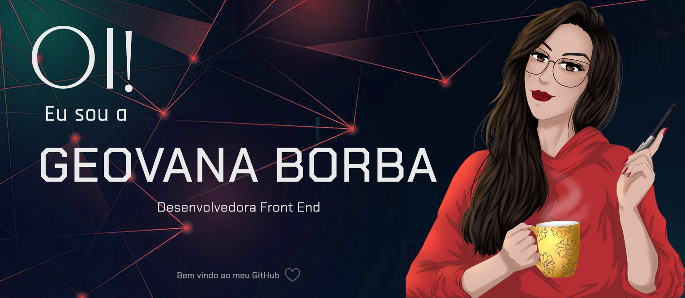
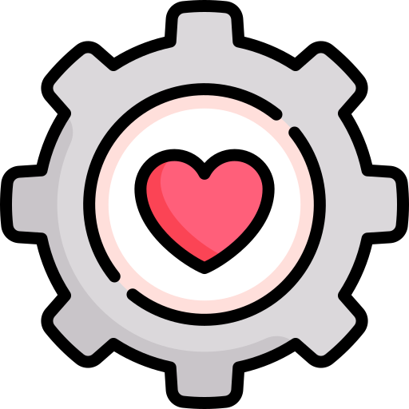

  

# Seja bem vindo ao meu GitHub

 

#  Contate-me

 

 

### 📚 Um pouco sobre minha trajetória de estudos 

<b>Sou formada em Marketing pela Universidade Bras Cubas, mas busco migração de carreira para a área de desenvolvimento. </b>

Durante a pandemia me deparei com uma imersão Dev feita de forma gratuita, o que me jogou de cabeça no mundo da programação. Me apaixonei pelo Front End e comecei a estudar por conta própria, enquanto fazia trabalhos freelancer como ilustradora. 

Também realizei o Bootcamp Carrefour pela Digital Inovation One (Dio) e participei de algumas outras imersões realizadas gratuitamente, como as da escola Alura e DevSuperior.

Em meio a essa jornada, quis me aprofundar um pouco mais.

* Me formei em 2023 em <b>técnico em Desenvolvimento de Sistemas pela Etec.</b>
* Atualmente, estou fazendo o curso <b>Fullstack JavaScript da One Bit Code </b>♥

  

<a href="#">

# Confira meu portfólio

</a>

   

#  &nbsp;GitHub Analytics

</a>

#### 💡 "Primeiro resolva o problema. Depois escreva o código" 

  

# Skills

 

 

 
 
 

### Tecnologias que já tive contato:

 

 
 

 
 

  

###### Geovana Borba &copy;

